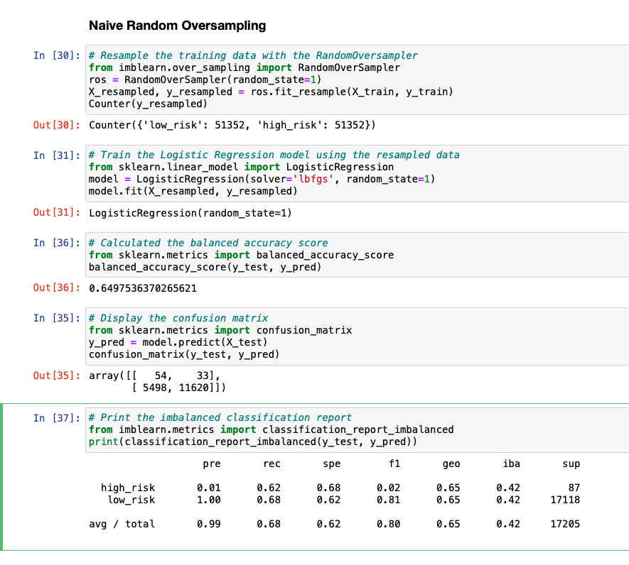
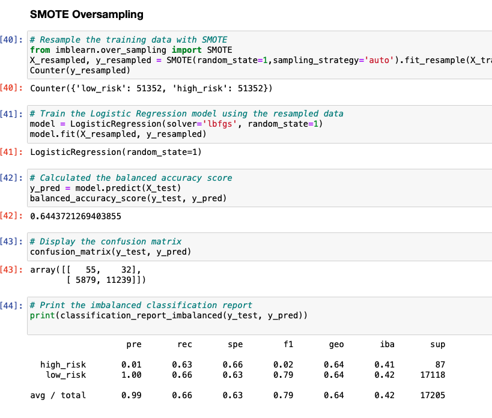
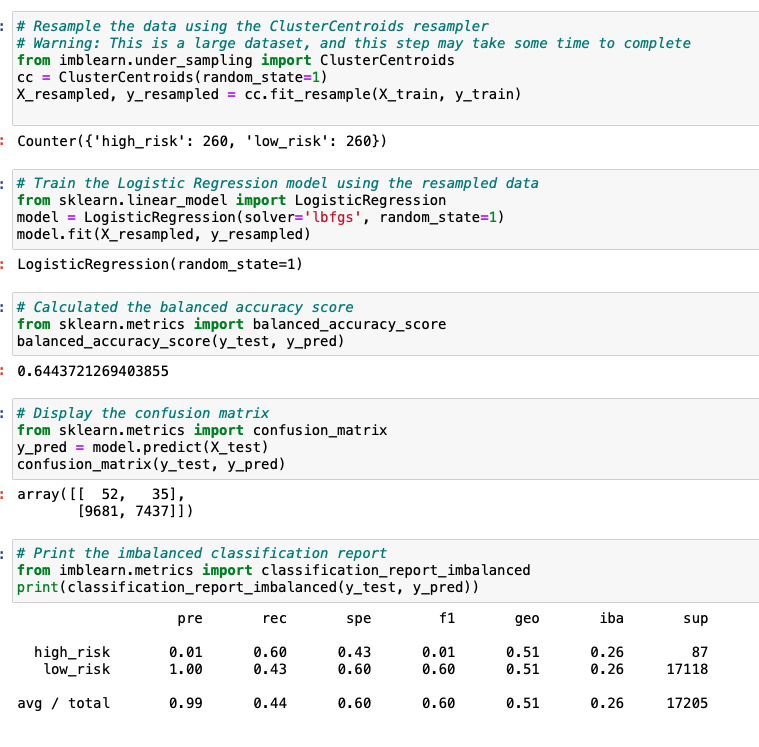
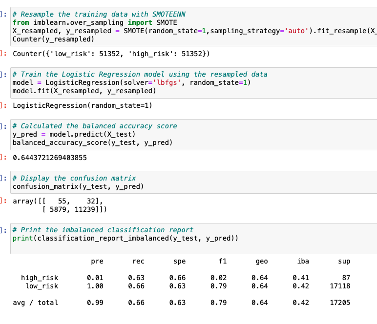
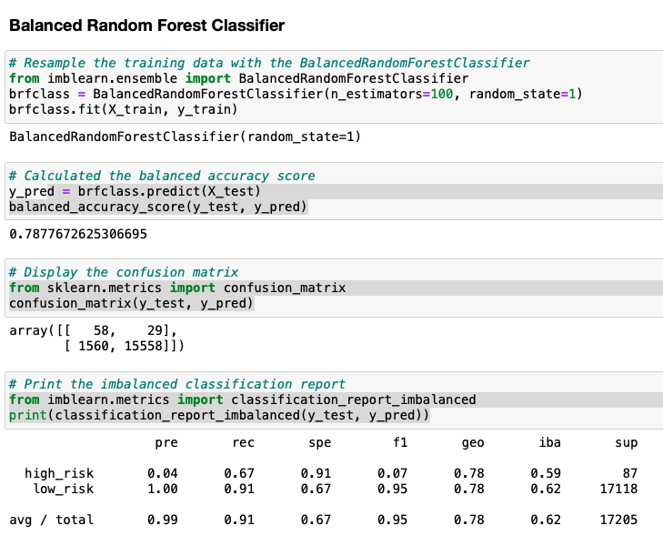
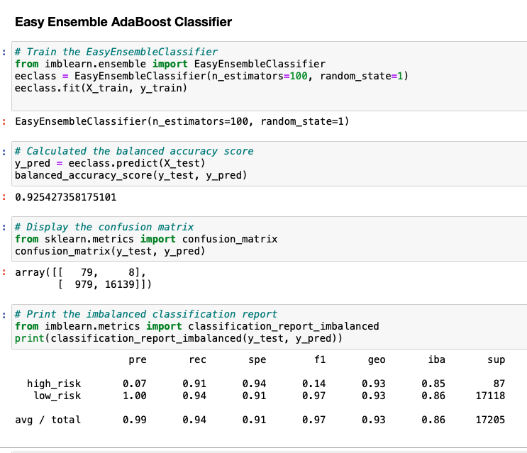

# Credit_Risk_Analysis

## Overview of the analysis: 
This analysis examines various machine learning models abilty to predict credit risk. The models examed are Random Oversampling, SMOTE, Cluster Centroids, Smoteenn, Balanced Random Forest Classifier and Easy Ensemble Classifier. 

## Results: 

  ### Random Oversampling

 
  - Balancnced Accuracy: 65%
  - High Risk Percision: 1%
  - Overall Percision: 99%
  - Overall Sensitivity: 62%
 
 
 
  ### SMOTE

  - Balancnced Accuracy: 64%
  - High Risk Percision: 1%
  - Overall Percision: 99%
  - Overall Sensitivity: 66%

  ### Cluster Centroids

  - Balancnced Accuracy: 64%
  - High Risk Percision: 1%
  - Overall Percision: 99%
  - Overall Sensitivity : 44%
 

  ### Smoteenn

  - Balancnced Accuracy: 64%
  - High Risk Percision:1%
  - Overall Percision:99%
  - Overall Sensitivity 66%

  ### Balanced Random Forest Classifier

  - Balancnced Accuracy: 79%
  - High Risk Percision: 4%
  - Overall Percision: 99%
  - Overall Sensitivity: 91% 
 

  ### Easy Ensemble Classifier

  - Balancnced Accuracy: 92%
  - High Risk Percision: 7%
  - Overall Percision: 99%
  - Overall Sensitivity: 94% 
 

# Summary: 

I would not recommend the use of any of these models to predict credit risk. All models show weak precision when determing high credit risk. 
